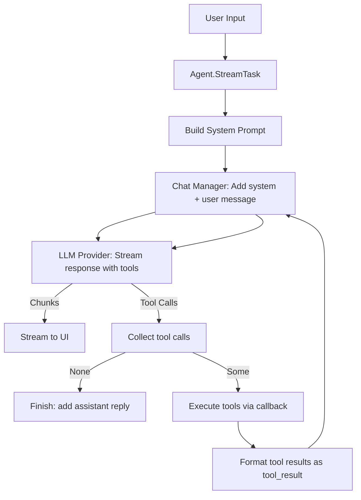
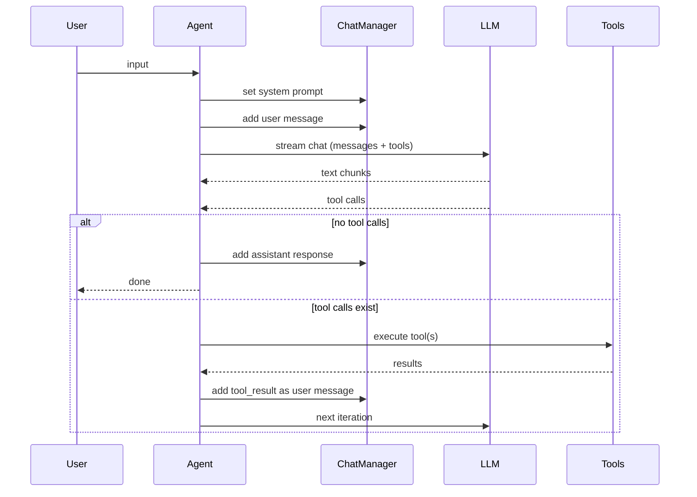
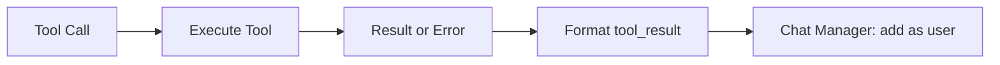
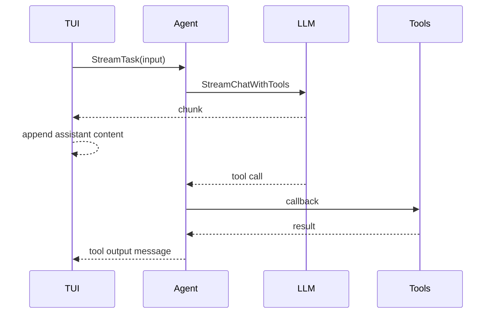
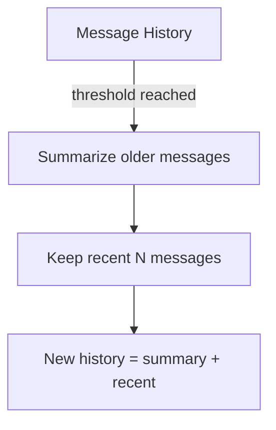
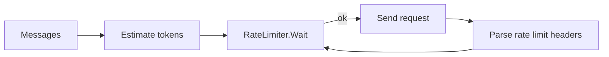

# Agent Specification

This document explains the core agent logic in Storage Doctor and how it processes user requests, tool calls, and responses. It uses Mermaid diagrams and plain language so new contributors can follow the flow quickly.

## Goals

- Provide a clear mental model of the agent loop.
- Explain how tools are selected, executed, and fed back into the conversation.
- Show how streaming works and how the TUI fits in.

## Key Concepts

- **Agent**: Orchestrates the conversation loop, tool calls, and iteration limits.
- **Chat Manager**: Stores messages and summaries for context management.
- **LLM Provider**: Streams model output and tool calls.
- **Tools**: Actions the agent can request (execute command, read/write file, web search, etc.).
- **TUI**: Renders streaming output and approval prompts while maintaining a message timeline.

## High-Level Flow

## Agent Loop (Core Logic)

The agent runs a loop that:

1. Builds/refreshes the system prompt (skills, rules).
2. Adds the user input to the chat history.
3. Streams the model response and collects tool calls.
4. If no tool calls are requested, it finalizes the assistant response and exits.
5. If tool calls exist, it executes each tool, appends results as a user message, and repeats.

## Tool Execution Path

Tool calls are executed by the runtime (CLI/TUI) via a callback. Each result is formatted into a `<tool_result>` block and appended as a user message so the LLM can reason with it in the next step.

## TUI Integration

The TUI runs the agent with streaming callbacks. It is responsible for:

- Rendering incremental assistant text.
- Displaying tool output in the message timeline.
- Asking for approvals when required (execute command, write file).
- Showing rate-limit wait status.

## Context Management

The chat manager stores conversation history. When the history exceeds a threshold, it creates a summary of older messages and replaces them with a single system summary message, keeping the most recent messages intact. This reduces token usage while preserving important details.

## Rate Limiting (Streaming Safety)

Before sending a request to the LLM provider, the system estimates token usage and waits if it would exceed the current rate limit window. If the API returns rate limit headers, those limits are updated for future requests.

## Files to Read First

- `internal/agent/agent.go` (core loop)
- `internal/chat/manager.go` (message storage + summarization)
- `internal/llm/anthropic.go`, `internal/llm/openai.go` (streaming + tool calls)
- `cmd/storage-doctor/tui_*` (TUI rendering + approvals)

## Practical Notes

- Tool calls are treated as part of the conversation: results are passed back to the model.
- The agent stops after a maximum iteration count to avoid infinite tool loops.
- In the TUI, the output is appended in order so users can scroll through the entire timeline.

